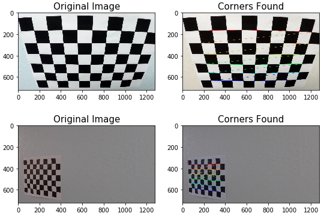
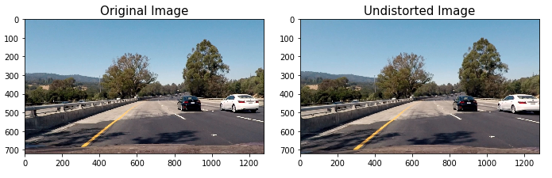
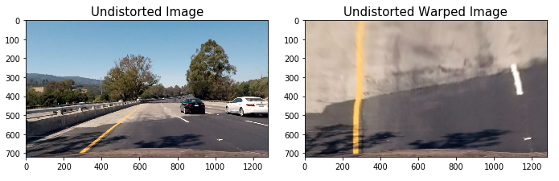
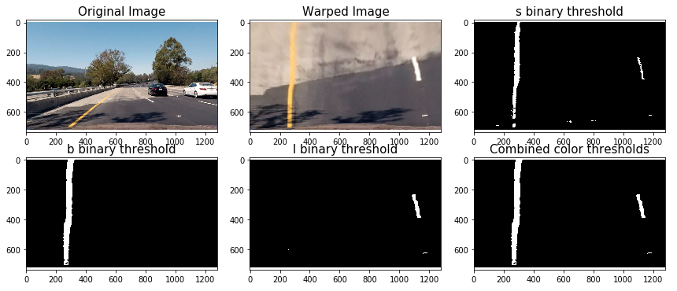
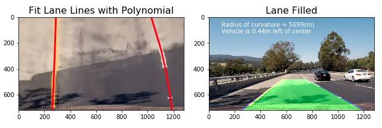

## Advanced Lane Finding

In this project, my goal is to write a software pipeline to identify the lane boundaries in a video.

The goals / steps of this project are the following:

* Compute the camera calibration matrix and distortion coefficients given a set of chessboard images.
* Apply a distortion correction to raw images.
* Use color transforms, gradients, etc., to create a thresholded binary image.
* Apply a perspective transform to rectify binary image ("birds-eye view").
* Detect lane pixels and fit to find the lane boundary.
* Determine the curvature of the lane and vehicle position with respect to center.
* Warp the detected lane boundaries back onto the original image.
* Output visual display of the lane boundaries and numerical estimation of lane curvature and vehicle position. 

The code for these steps can be found in the [Jupyter notebook](https://github.com/zhoujh30/CarND-Advanced-Lane-Lines-P4/blob/master/Advanced_Lane_Finding.ipynb).  

### Camera Calibration

I started by using [OpenCV](http://opencv.org/) functions `findChessboardCorners` and `drawChessboardCorners` in the 2nd cell of the [Jupyter notebook](https://github.com/zhoujh30/CarND-Advanced-Lane-Lines-P4/blob/master/Advanced_Lane_Finding.ipynb) to identify corners of a list of chessboard pictures from different perspectives. For example, here are two pairs of pictures before and after corners were found:

  

I then used the output `objpoints` and `imgpoints` to compute the camera calibration and distortion coefficients using the `cv2.calibrateCamera()` function in the 3rd and 4th cell of the [Jupyter notebook](https://github.com/zhoujh30/CarND-Advanced-Lane-Lines-P4/blob/master/Advanced_Lane_Finding.ipynb).  I applied this distortion correction to the test image using the `cv2.undistort()` function and obtained this result: 

  

### Pipeline (single images)

I then started processing the distortion-corrected images like the example showed above. 

#### 1. Performed perspective transform

The code for my perspective transform includes a function called `corners_unwarp()` in the 5th and 6th code cell of the [Jupyter notebook](https://github.com/zhoujh30/CarND-Advanced-Lane-Lines-P4/blob/master/Advanced_Lane_Finding.ipynb). The `corners_unwarp()` function takes an input of an image (`img`), but also needs specified source (`src`) and destination (`dst`) points. I chose the following source and destination points:

| Source        | Destination   | 
|:-------------:|:-------------:| 
| 490, 482      | 0, 0        | 
| 810, 482      | 1280, 0      |
| 1250, 720     | 1250, 720      |
| 40, 720       | 40, 720        |

Here is an example before and after applying the `corners_unwarp()` function:

  

#### 2. Created thresholded binary

I used a combination of color and gradient thresholds to generate a binary image in the 7th and 8th code cell of the [Jupyter notebook](https://github.com/zhoujh30/CarND-Advanced-Lane-Lines-P4/blob/master/Advanced_Lane_Finding.ipynb). Here is the channels I found to be good at isolating the lane line pixels:

| Channel        | Color Space   | Min Threshold  | Max Threshold |
|:-------------:|:-------------: | :-------------:|:-------------:| 
| S             | HLS            | 180            |255            |
| B             | Lab            | 155            |200            |
| L             | LUV            | 255            |255            |

Here's an example of my output for this step:

  

#### 3.  Fitted lane lines with a polynomial, calculated curvature and filled lanes

I detected lane pixels and fitted it with a polynomial using [NumPy](http://www.numpy.org/) functions `numpy.nonzero()` and `numpy.polyfit()`.

I then calculated the position of the vehicle with respect to center by:
*Calculating the average of the x intercepts from each of the two polynomials 
*Calculating the distance between the vehicle position and the midpoint of horizontal axis 
*Identifying the position of the vehicle (If the horizontal position of the car was greater than the midpoint then the car was considered to be left of center, otherwise right of center)
*Converting the distance from pixels to meters

After that, I calculated the radius of curvature for each lane based on [an methodology by M. Bourne](https://www.intmath.com/applications-differentiation/8-radius-curvature.php).

Finally, I filled the space between the two lane lines to highlight the area.

  

---

### Pipeline (video)

After the images were processed, the final step was to develop a pipeline to process videos--a streaming of images. 

One important step for video processing is to keep track of things like where last several detections of the lane lines were and what the curvature was, so new detections can be properly treated. To do this, I defined a `Line()` class in the 11th cell of the [Jupyter notebook](https://github.com/zhoujh30/CarND-Advanced-Lane-Lines-P4/blob/master/Advanced_Lane_Finding.ipynb) to keep track of all the interesting parameters I measure from frame to frame. Once I found the lane lines in one frame of video, and if I was reasonably confident they were actually the lines I was looking for, I didn't need to search blindly in the next frame. I could simply search within a window around the previous detection.

Here are processed results from project video and challenge video:

|Project Video|Challenge Video|
|-------------|-------------|
|||

---

### Discussion

Overall, the lane finding methodology used in this project worked quite well compared to a previous one: [CarND-LaneLines-P1](https://github.com/zhoujh30/CarND-LaneLines-P1). The processed project video did a pretty robust job of identifying lane lines of all time. On a chellenge video, however, it achieved mostly satisfying detection but failed when there was a heavy shadow under the bridge and when a car was getting closer to the right lane. I also tested the processing pipeline on the harder challenge video--it failed on the most part since there were constantly changes of lane color comparison with shadow or reflection of sunshine.

To improve the result, I can further fine-tune the choices of threholds and channels used in combined binary. The other approach is to explore the potential of using neural network to better detect lane lines.